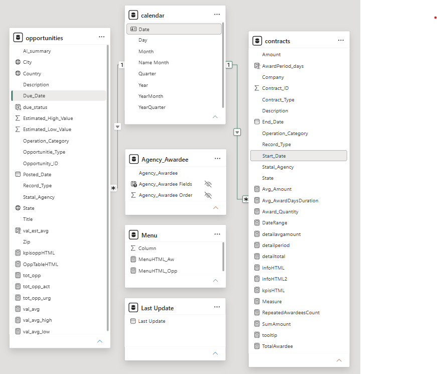
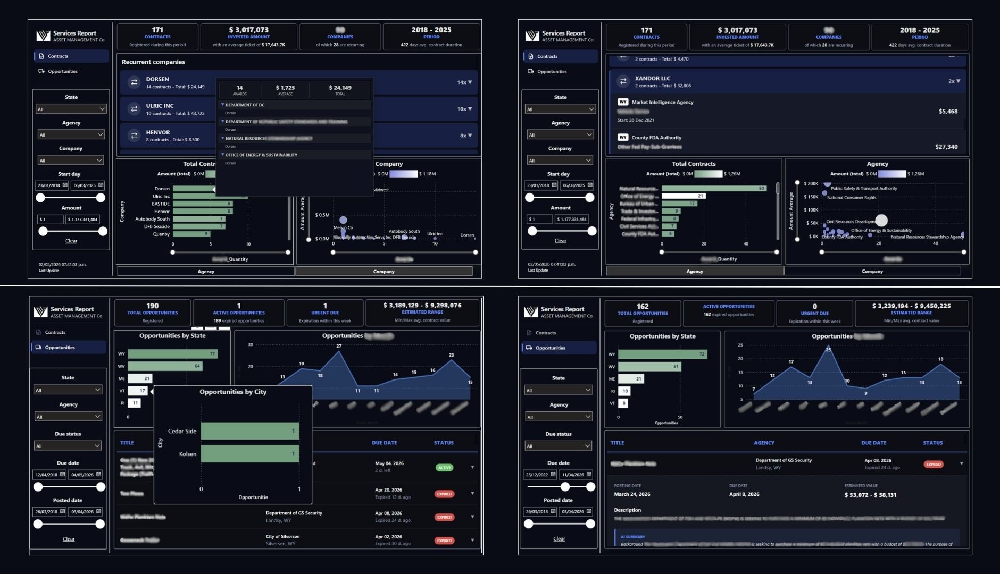
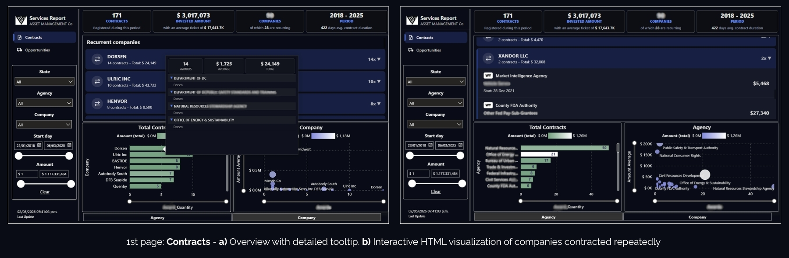
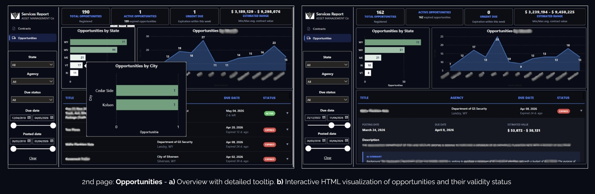

# 📄 State Services Market Research (US)
### Contract Bidding & Opportunity Intelligence Dashboard

**Power BI • CSV • Excel • Snowflake • HTML visuals**

#### 📌 Executive Summary

- Analyzed historical US public service contracts and bidding opportunities
- Identified recurring vendors, agency demand patterns, and contract trends
- Built KPI-driven dashboards for opportunity tracking and urgency analysis
- Developed custom HTML visuals and interactive Power BI reporting

**Some data was modified for reasons of corporate confidentiality.**

## 🗃️ Relational model and BI report

### 🗄️ Data Model

<b> 📑 Table details </b>

 

- `Contracts`

| Column | Data Type | Description |
|:---|:---|:---|
| `Contract_ID` | Integer | Unique contract identifier |
| `Operation_Category` | Text | Operation / service category |
| `Record_Type` | Text | Record type |
| `State` | Text | US state |
| `Statal_Agency` | Text | Public entity requesting services |
| `Company` | Text | Awarded company |
| `Description` | Text | Contract description |
| `Amount` | Currency | Total contract value |
| `Start_Date` | Date | Contract start date |
| `End_Date` | Date | Contract end date |
| `Contract_Type` | Text | Contract clasification |

- `Opportunities`

| Column | Data Type | Description |
|:---|:---|:---|
| `Opportunity_ID` | Integer | Unique Opportunity identifier |
| `Operation_Category` | Text | Operation / service category |
| `Record_Type` | Text | Record type |
| `Opportunitie_Type` | Text | Opportunitie clasification |
| `Title` | Text | Contract title |
| `Description` | Text | Contract description |
| `AI_summary` | Text | Contract description by AI |
| `Posted_Date` | Date | Opportunity publication date |
| `Due_Date` | Date | Bid expiration date |
| `Statal_Agency` | Text | Contractor |
| `Estimated_Low_Value` | Currency | Lowest estimated contract value |
| `Estimated_High_Value` | Currency | Highest estimated contract value |
| `Country` | Text | Country name |
| `State` | Text | US state |
| `City` | Text | US city |
| `Zip` | Text | City zip code |

---

- `Relational model pbix after ETL and DAX measures`
  

  

## 💻 Power BI report

  

#### 📊 1st page: Contracts

  

#### 📊 2nd page: Opportunities

  

### 🗃️ ETL and DAX code

<b> ✒️ Main DAX measures </b>

 
- 1
- 2

## 🗃️ Contact and info

* You are welcome to:

**Request services**, compose a friendly **e-mail**, **send requests** and **suggestions** to: <sidolipriscilag@gmail.com>
  
Priscila Gutierrez Sídoli - Linkdn  

> **If you found this project interesting, please consider giving the repository a ⭐ to support the work.**

